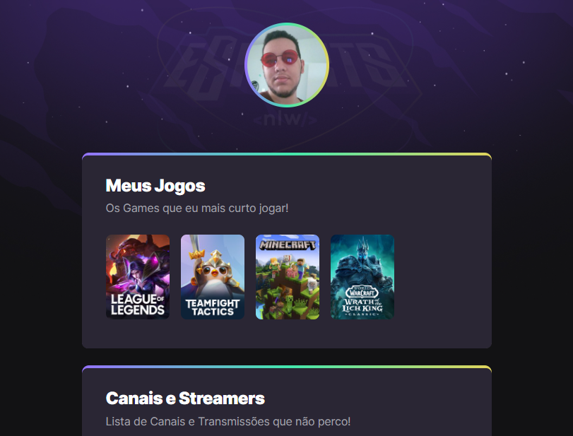

# NLW eSports 

> Trilha Explorer

Projeto construído do evento Next Level Week da Rocketseat.

[🔗 Clique aqui para acessar](https://raphael-jucius.github.io/nlw-esports-explorer/)

# 🛠️ Tecnologias

- HTML
- CSS
- Git e Github

# O que aprendi

- HTML Básico
- CSS Básico
- Utilização de Visual Studio Code
- Criação de repositório Git com o Visual Studio Code

# 🧑‍💻 Contato

raphael.jucius@gmail.com